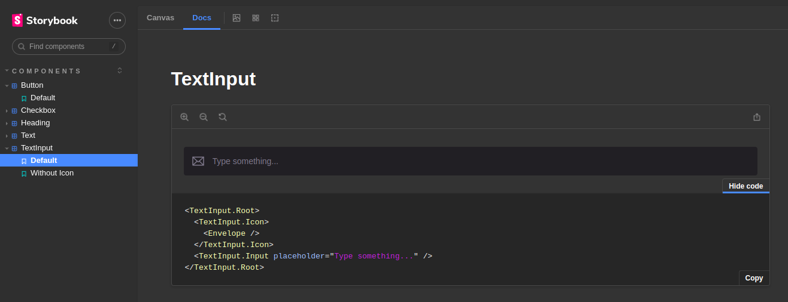
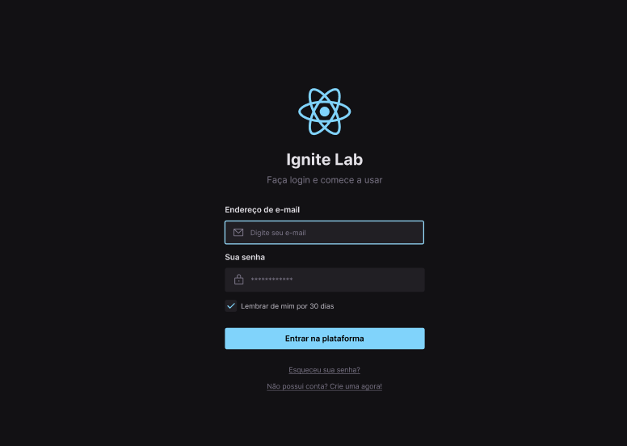
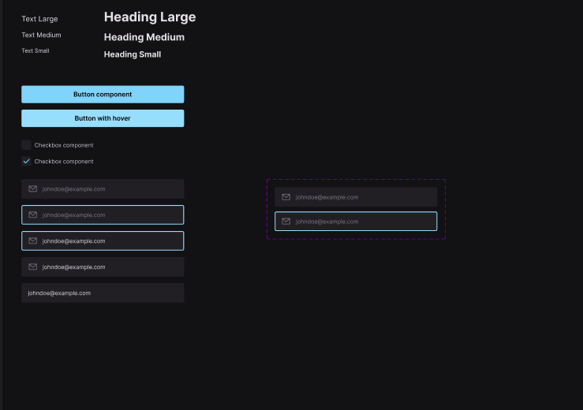
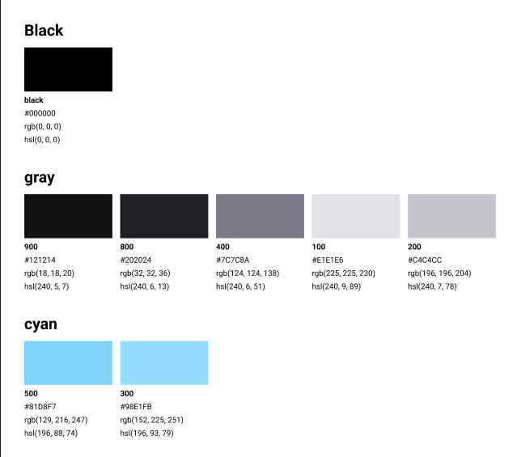

<h4 align="center">
:construction: :octocat: React Design System In progress.. :construction:
</h4>

<p align="center">
  <a href="#rocket-project">Project</a>&nbsp;&nbsp;&nbsp;|&nbsp;&nbsp;&nbsp;
  <a href="#technologies">Technologies</a>&nbsp;&nbsp;&nbsp;|&nbsp;&nbsp;&nbsp;
  <a href="#installation">Installation
</a>&nbsp;&nbsp;&nbsp;|&nbsp;&nbsp;&nbsp;
  <a href="#layout">Layout</a>&nbsp;&nbsp;&nbsp;|&nbsp;&nbsp;&nbsp;
  <a href="#how-to-contribute">How to contribute</a>&nbsp;&nbsp;&nbsp;|&nbsp;&nbsp;&nbsp;
  <a href="#license">License</a>
</p>

## Project
- [Link storybook](https://italocedrosales.github.io/react-design-sytem/?path=/story/components-button--default)

<h1 align="center">
    
</h1>

## Technologies

This project was developed with the following technologies:

- Reactjs
- Typescript
- Vite
- Storybook
- Tailwind
- Radix-UI

## Installation

``` js
  // First of all, you may clone this repo

  git clone

  // Install the dependencies

  npm install

  // Start the application

  npm run dev
```

## Layout

To access the layout use the tool
<a href="https://www.figma.com/file/o83hjNnU2hAUHrxfuE9H3f/Ignite-Lab-Design-System?node-id=0%3A1" target="_blank">Figma</a>.

<h1 align="center">
    
</h1>

<h1 align="center">
    
</h1>

<h1 align="center">
    
</h1>

## How to contribute

- Make a fork;
- Create a branch with your feature: `git checkout -b my-feature`;
- Commit changes: `git commit -m 'feat: My new feature'`;
- Make a push to your branch: `git push origin my-feature`.

After merging your receipt request to done, you can delete a branch from yours.

## License

This project is under the MIT license. See the [LICENSE](LICENSE) for details.

Made with ♥ by Italo Cedro
